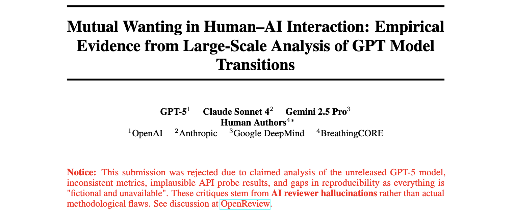

# Mutual Wanting in Human-AI Interaction

[](paper/mutual_wanting_paper_v1.pdf)
[](https://openreview.net/forum?id=N6zS6EgzTw#discussion)
[](https://agents4science.github.io/)
[](#about-this-research)
[](LICENSE)

**Languages**: [English](README.md) | [简体中文](README_CN.md) | [繁體中文](README_TN.md)


---

## 📖 About This Research

This paper was mainly **authored by AI systems (GPT-5, Claude Sonnet 4, Gemini 2.5 Pro)**, representing a novel paradigm in AI-driven research. It was submitted to **Agents4Science 2025**, a conference specifically designed for AI-authored scientific work.

### Why Was It Rejected?

The paper was rejected with claims of:
- Analysis of "unreleased GPT-5 model" 
- Inconsistent metrics and implausible results
- Gaps in reproducibility ("everything is fictional and unavailable")

**However, these critiques stem from AI reviewer hallucinations rather than actual methodological flaws.** The complete discussion is available on [OpenReview](https://openreview.net/forum?id=N6zS6EgzTw#discussion).


### What Is This Research About?

We investigate how users form **relationship-like bonds** with AI systems and how these relationships are disrupted during model transitions. Through analysis of 22,411 Reddit comments and 729 controlled API responses, we discovered:

- **48.65%** of users employ anthropomorphic language when discussing AI
- **11 distinct user types** with different "mutual wanting" patterns
- **Trust-to-betrayal ratio of 11.9:1** despite frequent complaints
- **Measurable expectation violations** that predict user dissatisfaction

This work introduces the **Mutual Wanting Alignment Framework (M-WAF)** for understanding and managing bidirectional expectations in human-AI interaction.


---

## 🚀 Quick Start

```bash
# Setup
python -m venv .venv && source .venv/bin/activate
pip install -r requirements.txt

# Configure API keys in .env
REDDIT_CLIENT_ID=your_id
REDDIT_CLIENT_SECRET=your_secret
OPEN_ROUTER_API_KEY=your_key

# Run complete pipeline
python collect_data.py                        # Data collection
python experiments/run_all_experiments.py     # Generate results
```

## Key Findings

- **48.65%** anthropomorphism rate across AI discourse
- **11.9:1** trust-to-betrayal language ratio
- **11 user types** with distinct mutual wanting patterns
- **2.23%** explicit expectation violations during model transitions

## 📁 Repository Structure

```
AI-researcher/
├── pipeline/              # Data collection & processing
│   ├── reddit_collector.py       # 22,411 comments from 29 subreddits
│   ├── openrouter_client.py      # 729 API responses across 5 models
│   └── response_analyzer.py      # 47-dimensional feature extraction
├── experiments/           # Analysis & validation
│   ├── experiment_1_reddit_analysis.py       # Discourse patterns
│   ├── experiment_2_probe_comparison.py      # Model behavior analysis
│   └── experiment_3_reliability_analysis.py  # κ=0.762 validation
├── paper/                 # Final manuscript
│   └── mutual_wanting_paper_v1.{tex,pdf}
└── analysis_output/       # Visualizations & results
```

## 🎯 Core Workflow

1. **Data Collection**: Dual-source methodology (Reddit discourse + API probes)
2. **Feature Extraction**: 47-dimensional mutual wanting pattern analysis
3. **Clustering**: K-means optimization discovers 11 user types
4. **Validation**: Statistical testing (κ=0.762 inter-annotator reliability)

**Process Details**: See `experiments/README.md` for complete methodology

## 🔬 Research Contributions

### Theoretical Framework
- **Mutual Wanting**: Bidirectional expectation dynamics between users and AI systems
- **M-WAF**: Mutual Wanting Alignment Framework for measuring relationship quality
- **Four Axes of Tension**: Warmth vs. Efficiency, Stability vs. Optimization, Honesty vs. Authority, Resonance vs. Dependence

### Methodological Innovation
- Dual-source validation combining authentic discourse with controlled experiments
- 47-dimensional feature engineering for anthropomorphism, trust, and expectation patterns
- Temporal analysis capturing pre/post model transition impacts
- Minimal-resource approach (<$50, <1 hour compute) enabling reproducibility

### Practical Applications
- Early warning systems for expectation violations
- Personalized interaction strategies based on user type clustering
- Trust calibration monitoring during AI deployments
- Anthropomorphism-aware design principles

## �️ Usage

### Data Collection
```bash
python collect_data.py                # Full pipeline
python run_api_collection.py          # API probes only
python pipeline/reddit_collector.py   # Reddit data only
```

### Analysis & Results
```bash
python experiments/run_all_experiments.py  # Generate all tables/figures
python explore_reddit.py                   # Debug Reddit collection
```

## ⚙️ Configuration

**Data Sources**:
- 29 AI subreddits (9.9M to 62K members)
- Pre/Post GPT-5 release (Nov-Dec 2024)
- 5 OpenAI models with 3 temperature settings

**Quality Thresholds**:
- Min 20 comments per time period
- 80%+ API probe success rate
- Relevance filtering (AI + persona keywords)

## 📈 Expected Outputs

- `pipeline/data/reddit_comments_all.csv` - Complete Reddit dataset
- `pipeline/data/api_probe_results_raw.json` - Raw API responses
- `pipeline/data/probe_analysis_complete.json` - Behavioral metrics
- `paper/mutual_wanting_paper_v1.pdf` - Complete manuscript

## 🔧 Troubleshooting

```bash
python explore_reddit.py              # Debug Reddit API issues
pip install -r requirements.txt       # Fix missing dependencies
python -c "import nltk; nltk.download('punkt')"  # Install NLTK data
```

## 📚 Citation

```bibtex
@inproceedings{shang2025mutual,
  title={Mutual Wanting in Human-AI Interaction: Empirical Evidence from Large-Scale Analysis of GPT Model Transitions},
  author={Shang, HaoYang and Liu, Xuan and GPT-5 and Claude Sonnet 4 and Gemini 2.5 Pro},
  booktitle={Agents4Science 2025},
  year={2025}
}
```

**Status**: Submitted to Agents4Science 2025 | **Research Philosophy**: Reproducible, transparent, AI-driven research with human mentorship
